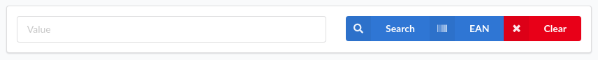
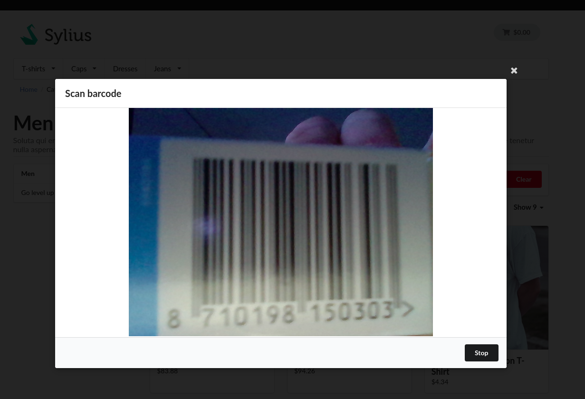
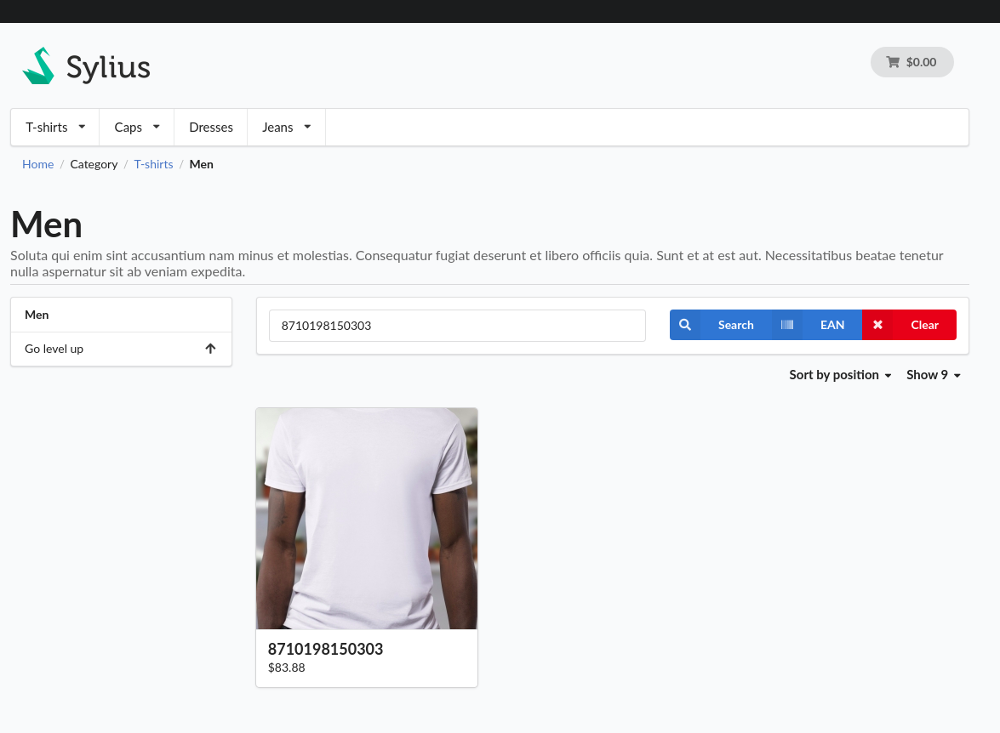

This plugin integrates [quagga2](https://github.com/ericblade/quagga2) with the Sylius product grid search.

It does so by adding a button to the search bar that enables shoppers to use the camera on their device to search for a EAN barcode.



When the user's browser supports it and the user gives permission to use the camera, the user can attempt to scan a barcode. Currently only standard EAN barcodes are supported.



Subsequently, if a valid EAN barcode is recognised, the barcode will be used as search criteria. In this example the name of the product is the barcode.
However, it is possible to store the EAN in a product attribute and configure the product grid to include the attribute in the search process.



#### Installation:

1. Install using composer:
    ```bash
    composer require 4c0n/sylius-barcode-search-plugin
    ```
2. Add bundle to bundles.php:
    ```php
    # config/bundles.php
    <?php

    return [
        ...
        Nedac\SyliusBarcodeSearchPlugin\NedacSyliusBarcodeSearchPlugin::class => ['all' => true],
    ];
    ```
3. Override template:
    ```twig
    {# templates/bundles/SyliusShopBundle/Product/Index/_search.html.twig #}
    <div class="ui segment">
        <form method="get" action="{{ path('sylius_shop_product_index', {'slug': app.request.attributes.get('slug')}) }}" class="ui loadable form" id="nedac-sylius-barcode-search-plugin-search-form">
            <div class="ui stackable grid" id="searchbar">
                <div class="column" id="searchbarTextField">
                    
                        {{ sylius_grid_render_filter(products, filter) }}
                    
                </div>
                <div class="right aligned column" id="searchbarButtons">
                    <div class="ui buttons">
                        <button type="submit" class="ui primary icon labeled button"><i class="search icon"></i> {{ 'sylius.ui.search'|trans }}</button>
                        <a href="#" class="ui primary icon labeled button" id="nedac-sylius-barcode-search-plugin-start-button">
                            <i class="barcode icon"></i> EAN
                        </a>
                        <a href="{{ path('sylius_shop_product_index', {'slug': app.request.attributes.get('slug')}) }}" class="ui negative icon labeled button">
                            <i class="cancel icon"></i> {{ 'sylius.ui.clear'|trans }}
                        </a>
                    </div>
                </div>
            </div>
        </form>
    </div>
    <div class="ui modal" id="nedac-sylius-barcode-plugin-scan-modal">
        <i class="close icon" id="nedac-sylius-barcode-plugin-scan-modal-close-button"></i>
        <div class="header">
            Scan barcode
        </div>
        <div class="nedac-sylius-barcode-plugin-viewport-container">
            <div id="nedac-sylius-barcode-plugin-interactive" class="viewport"></div>
        </div>
        <div class="actions">
            <div class="ui black deny button" id="nedac-sylius-barcode-plugin-scan-modal-stop-button">
                Stop
            </div>
        </div>
    </div>
    ```
4. Install assets:
    ```bash
   bin/console sylius:install:assets
    ```
Just four steps!
Now it's up to you to configure the product grid in such a way that a field containing the EAN is being filtered.

#### Setup development environment:
```bash
docker-compose build
docker-compose up -d
docker-compose exec php composer --working-dir=/srv/sylius install
docker-compose run --rm nodejs yarn --cwd=/srv/sylius/tests/Application install
docker-compose run --rm nodejs yarn --cwd=/srv/sylius/tests/Application build
docker-compose exec php bin/console assets:install public
docker-compose exec php bin/console doctrine:schema:create
docker-compose exec php bin/console sylius:fixtures:load -n
```
#### Running tests:
```bash
docker-compose exec php sh
bin/console doc:sch:create
cd ../..
vendor/bin/behat
```
